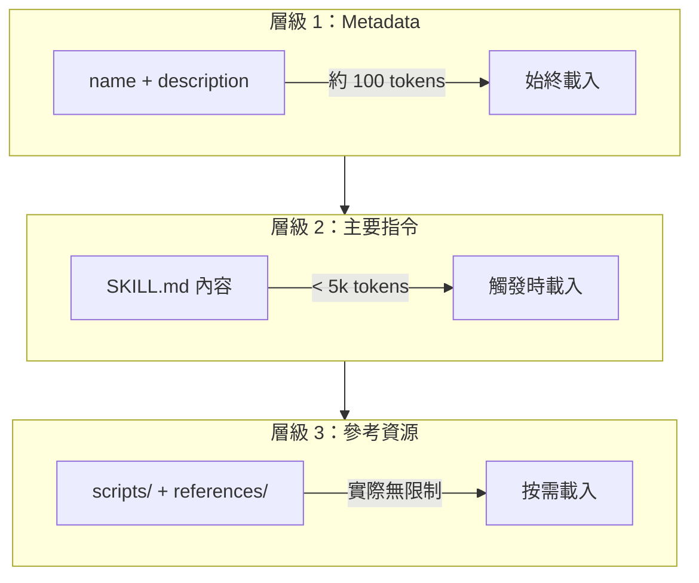
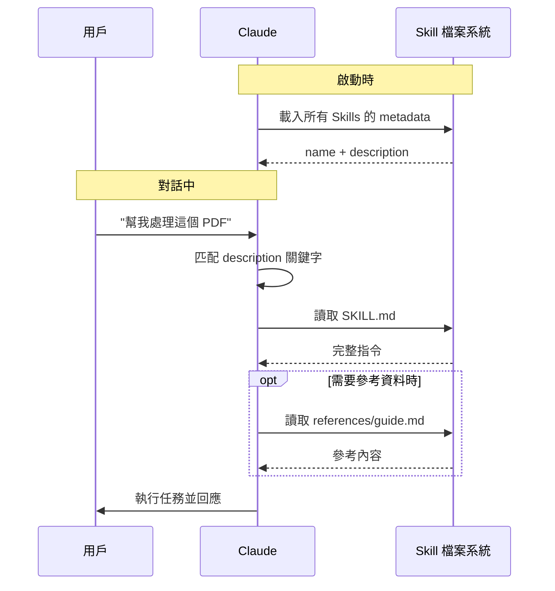
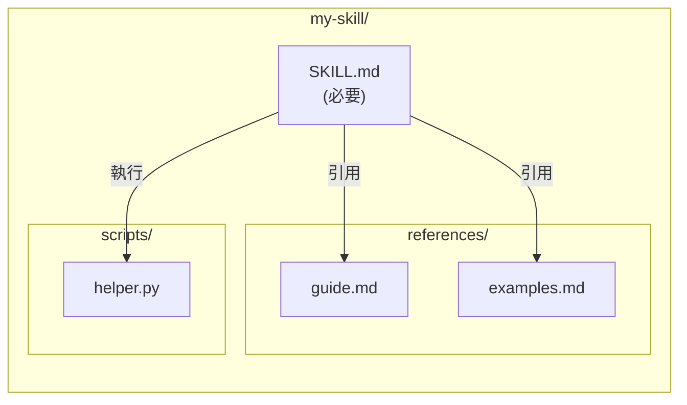
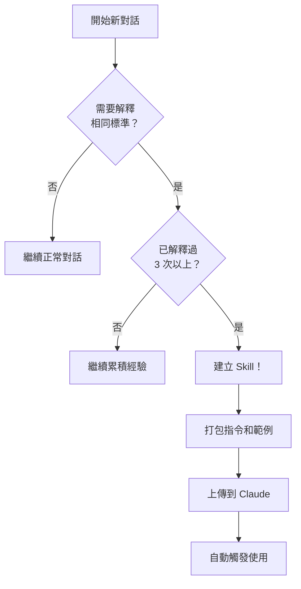

# Claude Skills 完整指南

> 本文件整理自 Anthropic 官方文件，翻譯為台灣繁體中文。
>
> **原文來源**：
> - [Agent Skills 概覽](https://platform.claude.com/docs/en/agents-and-tools/agent-skills/overview)
> - [快速入門](https://platform.claude.com/docs/en/agents-and-tools/agent-skills/quickstart)
> - [最佳實踐](https://platform.claude.com/docs/en/agents-and-tools/agent-skills/best-practices)
> - [在 Claude 中使用 Skills](https://support.claude.com/en/articles/12512180-using-skills-in-claude)
> - [教 Claude 按照你的方式工作](https://support.claude.com/en/articles/12580051-teach-claude-your-way-of-working-using-skills)

---

## 什麼是 Skills？

Skills 是可擴展 Claude 功能的模組化能力。每個 Skill 包含：
- **指令**：教 Claude 如何執行特定任務
- **Metadata**：描述 Skill 的用途和觸發時機
- **可選資源**：腳本、範本、參考資料

與每次對話都要重新解釋的 prompt 不同，Skills **按需自動載入**，消除重複說明的需要。

### 核心優勢

| 優勢 | 說明 |
|------|------|
| 專業化 | 將通用 Claude 轉變為特定領域專家 |
| 減少重複 | 一次建立，自動跨對話使用 |
| 可組合 | 結合多個 Skills 建構複雜工作流程 |
| 一致性 | 確保每次輸出符合你的標準 |

---

## Skills vs 其他功能

| 功能 | 用途 | 適用情境 |
|------|------|----------|
| **Skills** | 特定任務的專業知識包 | 報告格式、分析方法、品質標準 |
| **Projects** | 累積特定專案的上下文 | 產品開發、研究計畫 |
| **Custom Instructions** | 通用互動偏好 | 語調、格式、回應風格 |
| **一般 Prompting** | 一次性指示 | 簡單任務、臨時需求 |

**關鍵差異**：Skills 會**自動觸發**，不需每次手動提供指令。

---

## Skills 運作原理

### 漸進式揭露（Progressive Disclosure）

Skills 採用三層載入機制，優化 token 使用：



**這意味著**：你可以安裝多個 Skills 而不會消耗大量上下文。

### 載入流程



1. **啟動**：Claude 載入所有 Skills 的 name 和 description
2. **匹配**：用戶請求與 Skill 描述匹配時觸發
3. **讀取**：Claude 讀取 SKILL.md 的完整指令
4. **執行**：按需讀取額外參考檔案或執行腳本

---

## Skill 檔案結構

### 基本結構



```text
my-skill/
├── SKILL.md              # 必要：主要定義檔
└── references/           # 可選：參考資料
    ├── guide.md
    └── examples.md
```

### SKILL.md 格式

```yaml
---
name: skill-name
description: 說明此 Skill 做什麼，以及何時使用。
---

# Skill 標題

## 指令
[清晰的操作步驟]

## 範例
[具體的輸入/輸出範例]
```

### 欄位規範

| 欄位 | 必要 | 規範 |
|------|------|------|
| `name` | 是 | 最多 64 字元，僅小寫字母、數字、連字號 |
| `description` | 是 | 最多 1024 字元，描述功能與觸發時機 |

---

## 撰寫最佳實踐

### 1. 保持簡潔

Claude 已經很聰明。只提供它**不知道**的資訊。

```markdown
❌ 冗長版本：
PDF（可攜式文件格式）是一種常見的檔案格式，包含文字、
圖像和其他內容。要從 PDF 擷取文字，你需要使用程式庫...

✅ 簡潔版本：
使用 pdfplumber 擷取 PDF 文字：
```python
import pdfplumber
with pdfplumber.open("file.pdf") as pdf:
    text = pdf.pages[0].extract_text()
```
```

### 2. 撰寫有效的 Description

Description 決定 Skill 是否被觸發。必須包含：
- **做什麼**：具體功能
- **何時用**：觸發關鍵字

```yaml
✅ 好的範例：
description: 從 PDF 擷取文字和表格、填寫表單、合併文件。
當處理 PDF 檔案或用戶提到 PDF、表單、文件擷取時使用。

❌ 差的範例：
description: 處理文件
```

**重要**：使用第三人稱撰寫（「此 Skill 會...」而非「我可以幫你...」）

### 3. 控制自由度

根據任務敏感度調整指令精確程度：

| 自由度 | 適用情境 | 範例 |
|--------|----------|------|
| **高** | 多種方法皆可 | 程式碼審查、文件撰寫 |
| **中** | 有偏好模式但可調整 | 報告格式、API 呼叫 |
| **低** | 操作敏感、需一致性 | 資料庫遷移、安全操作 |

### 4. 使用工作流程模式

複雜任務使用 checklist 追蹤進度：

```markdown
## 文件審查流程

複製此 checklist 追蹤進度：

- [ ] 步驟 1：閱讀所有來源文件
- [ ] 步驟 2：識別關鍵主題
- [ ] 步驟 3：交叉驗證聲明
- [ ] 步驟 4：建立結構化摘要
- [ ] 步驟 5：驗證引用

**步驟 1：閱讀所有來源文件**
...
```

### 5. 提供具體範例

範例比描述更有效：

```markdown
## Commit 訊息格式

依照以下範例生成：

**輸入**：新增 JWT token 用戶驗證
**輸出**：
feat(auth): 實作基於 JWT 的身份驗證

新增登入端點和 token 驗證中介軟體
```

### 6. 避免常見錯誤

| 錯誤 | 正確做法 |
|------|----------|
| 使用 Windows 路徑 `\` | 使用 Unix 路徑 `/` |
| 提供太多選項讓 Claude 選 | 給一個預設方案 |
| 包含時效性資訊 | 使用「舊版模式」區塊 |
| 術語不一致 | 全文統一用語 |
| 參考檔案巢狀太深 | 從 SKILL.md 直接引用（一層） |

---

## 在 Claude.ai 使用 Skills

### 前置條件

| 方案 | 需求 |
|------|------|
| Enterprise | 管理員需在 Admin 設定啟用程式碼執行和 Skills |
| Team | 預設啟用，成員在設定 > 功能存取 |
| Max/Pro | 用戶可獨立啟用和上傳 |

### 啟用步驟

1. 前往 **設定 > 功能**
2. 確認**程式碼執行**已啟用
3. 開啟需要的 Skills

### 預建 Skills

Anthropic 提供以下預建 Skills，自動運作無需設定：

- **Excel (xlsx)**：建立試算表、分析資料、生成圖表
- **Word (docx)**：建立和編輯文件
- **PowerPoint (pptx)**：建立和編輯簡報
- **PDF (pdf)**：生成 PDF 文件

### 上傳自訂 Skills

1. 將 Skill 資料夾打包成 **ZIP 檔案**
2. 前往 **設定 > 功能 > Skills**
3. 點選上傳並選擇 ZIP 檔案

---

## 何時建立 Skills

當你發現自己**重複解釋相同的標準或偏好**時，就是建立 Skill 的好時機：



- 報告和更新的格式框架
- 分析方法論
- 需要特定素材或範本的品質標準
- 結合多種資源的複雜工作流程

**實用提示**：先用一般對話完成任務，識別你重複提供的上下文，再將其打包成 Skill。

---

## 安全考量

Skills 透過指令和程式碼擴展 Claude 的能力，因此請注意：

| 風險 | 建議 |
|------|------|
| Prompt 注入 | 只使用可信來源的 Skills |
| 資料外洩 | 審核外部網路連線 |
| 工具濫用 | 檢查腳本內容和依賴項 |

**黃金法則**：像安裝軟體一樣對待 Skills —— 只安裝來自可信來源的 Skills。

---

## 疑難排解

| 問題 | 解決方案 |
|------|----------|
| Skill 未觸發 | 檢查 description 是否包含相關關鍵字 |
| 上傳失敗 | 確認檔案大小限制、ZIP 結構正確 |
| 程式碼無法執行 | 確認已啟用程式碼執行功能 |
| Skill 未生效 | 確認 Skill 已在設定中開啟 |

---

## 延伸資源

- [Agent Skills Cookbook（範例集）](https://github.com/anthropics/claude-cookbooks/tree/main/skills)
- [Claude Code Skills 文件](https://code.claude.com/docs/en/skills)
- [Agent SDK Skills 指南](https://platform.claude.com/docs/en/agent-sdk/skills)
